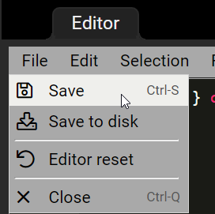

# 个人油猴脚本集合
## 一、什么是油猴脚本？
可以在浏览器上执行的js代码，而无需打开控制台。

## 二、如何使用油猴脚本？

### 1. 下载能加载脚本的插件
目前支持油猴脚的有谷歌浏览器，火狐浏览器，Edge，Safari等。
安装方法请参阅：
http://www.tampermonkey.net/

## 2. 下载脚本
- 可以在这里下载, 此社区比较活跃 https://greasyfork.org
- 也可以直接复制本项目的脚本

## 3. 使用脚本
### 方法一：从网上加载脚本
以 https://greasyfork.org  这个网址举例

#### 1. 比如我要一个b站的视频变速脚本, 首先搜索视频变速器

#### 2. 拉到下面，找到搜索结果

#### 3. 点进去，点击绿色的按钮"install this script"

#### 4. 最后，点击这个, 就可以成功安装啦

### 方法二: 复制本项目下的脚本
#### 1. 找到脚本的位置

#### 2. 全选复制

#### 3. 添加脚本

#### 4. 粘贴脚本

#### 5. 保存脚本

## 4. 验证是否安装成功
以上面的脚本为例
### 1.我们打开 www.bilibili.com
可以看到这个脚本亮了

### 2. 脚本的效果
可以在网页上添加了一丑丑的窗口，当时懒得做UI了，就只做了功能 

